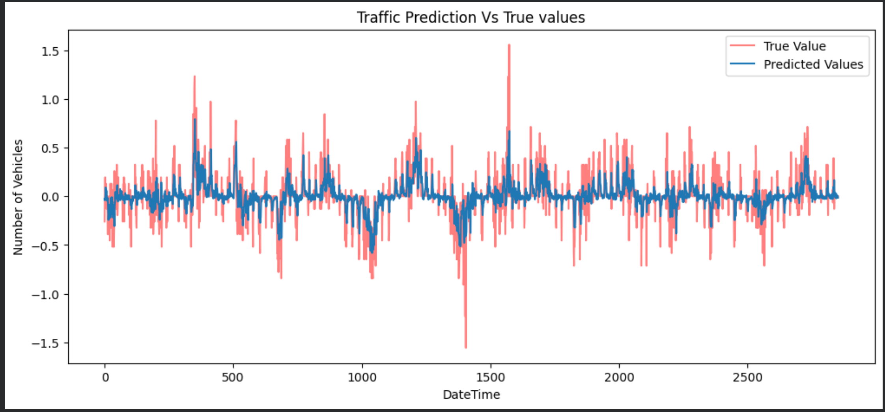
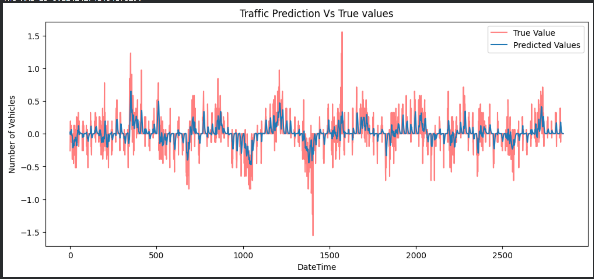

# 🚦Data-Driven-Traffic-Prediction-using-Machine-Learning-and-Artificial-Intelligence-
Urban Planning &amp; Infrastructure Optimization

## 📌 Overview
This project focuses on building a **data-driven traffic prediction system** using advanced Machine Learning and Deep Learning techniques.  
The goal is to analyze traffic patterns and accurately predict future traffic flow to support **smart city infrastructure and optimization**.

---

## ❗ Problem Statement
Urban traffic congestion is a major challenge, leading to:
- Increased travel time 🚗  
- Fuel inefficiency ⛽  
- Environmental impact 🌍  

Traditional systems fail to predict dynamic traffic patterns effectively.

👉 This project aims to develop a **robust predictive model** using historical traffic data.

---

## 💡 Solution
Developed an AI-based system that:
- Processes and analyzes traffic datasets  
- Learns temporal patterns using deep learning models  
- Predicts future traffic conditions with high accuracy  

---

## 🛠️ Tech Stack
- Python 🐍  
- Pandas, NumPy  
- Scikit-learn  
- TensorFlow / Keras  
- Matplotlib, Seaborn  

---

## 📊 Dataset
- Traffic dataset containing:
  - Time & Date  
  - Vehicle count  
  - Traffic density  
  - Road-related features  

---

## ⚙️ Methodology
1. Data Cleaning & Preprocessing  
2. Exploratory Data Analysis (EDA)  
3. Feature Engineering  
4. Train-Test Split Strategy  
5. Model Training & Validation  
6. Performance Evaluation  

---

## 🤖 Models Implemented
- **LSTM (Long Short-Term Memory)**  
- **MLP (Multi-Layer Perceptron)**  
- **GRU (Gated Recurrent Unit)**  

---

## 📈 Key Achievements
- ✅ Improved prediction accuracy to **~89%**  
- ✅ Reduced RMSE by **15%** through model optimization  
- ✅ Implemented **train-test split & validation** to prevent overfitting  
- ✅ Applied **feature engineering & hyperparameter tuning** for better performance  

---

## 📷 Visualizations
(Add your screenshots here)
### MLP Model

The root mean squared error is 0.17873297044298198.

The MAE is 0.11349030058948516.

### LSTM Model

The root mean squared error is 0.18149149392219652.

The MAE is 0.11424274243427829.
